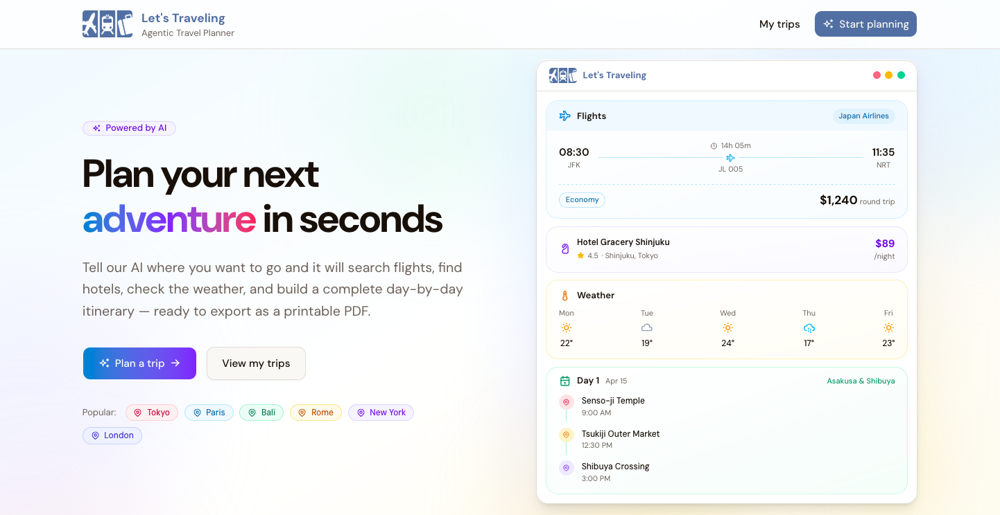
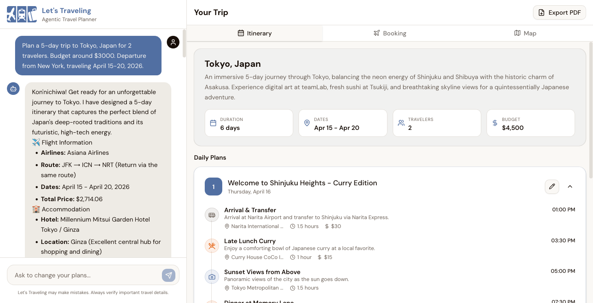
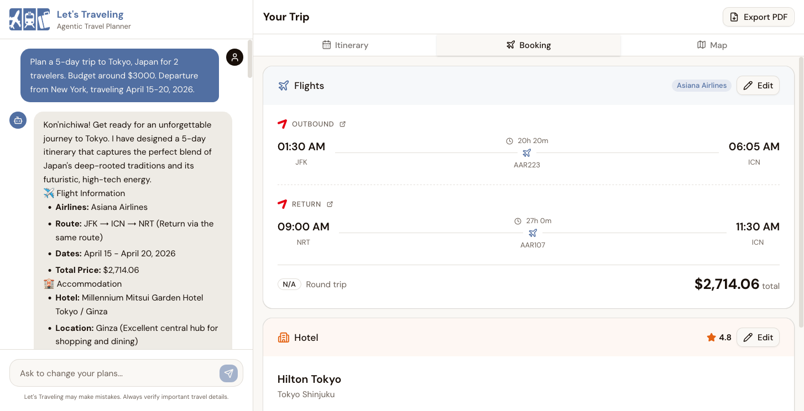
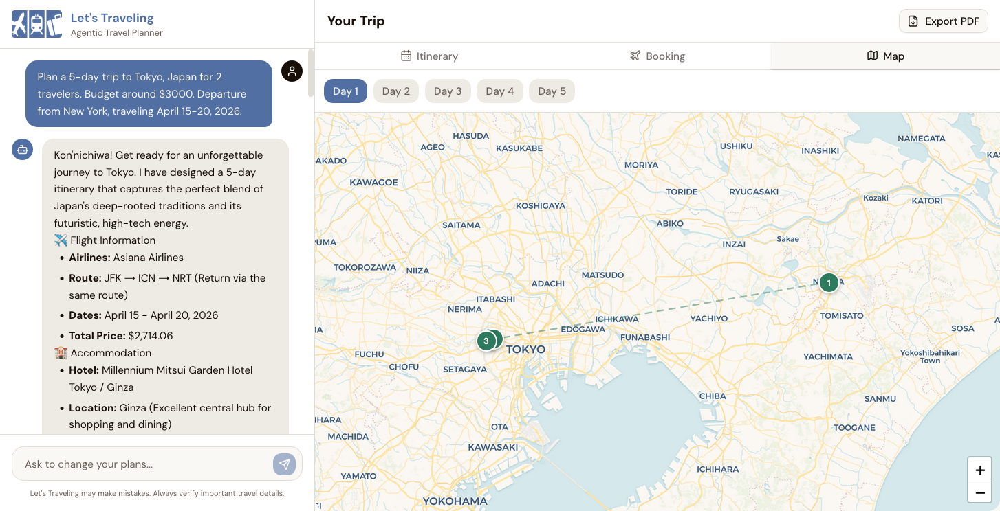

# Let's Traveling

|                                               |                                               |
| :-------------------------------------------: | :-------------------------------------------: |
|  |  |
|  |               |

AI-powered travel planning web app that turns a single prompt into an itinerary and lets you refine the plan via chat (flights/hotels/weather) and export the result as a PDF.

> [!NOTE]
> This project is part of the Generative AI course (040613708) at KMUTNB Computer Science.

## Features

- Generate trip plans from natural language prompts
- Agent-style tools for travel data (e.g. flights, hotels, weather)
- Edit/refine the itinerary through chat
- Export itinerary to PDF

## Tech Stack

- React + TypeScript (TanStack Start, Vite)
- Tailwind CSS + shadcn/ui
- Vercel AI SDK (LLM providers via API keys)
- PostgreSQL (Drizzle ORM)
- Redis/KeyDB (dev container provided)

## Getting Started (Dev)

1. Install dependencies

    ```bash
    bun install
    ```

2. Create environment file

    ```bash
    cp .env.example .env
    ```

3. Start Redis (KeyDB)

    ```bash
    docker compose -f docker-compose.dev.yml up -d
    ```

4. Ensure PostgreSQL is running and `DATABASE_URL` in `.env` is correct, then run migrations

    ```bash
    bun run db:migrate
    ```

5. Start the app

    ```bash
    bun run dev
    ```

Open `http://localhost:3001`.

## Useful Scripts

- `bun run dev` - start dev server
- `bun run build` - production build
- `bun run preview` - preview build
- `bun run db:generate` - generate migrations
- `bun run db:migrate` - run migrations
- `bun run db:studio` - open Drizzle Studio

## Project Layout

- `apps/www` - main web application
- `apps/docs` - project docs / pitching materials
